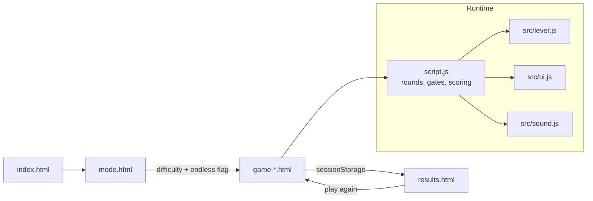
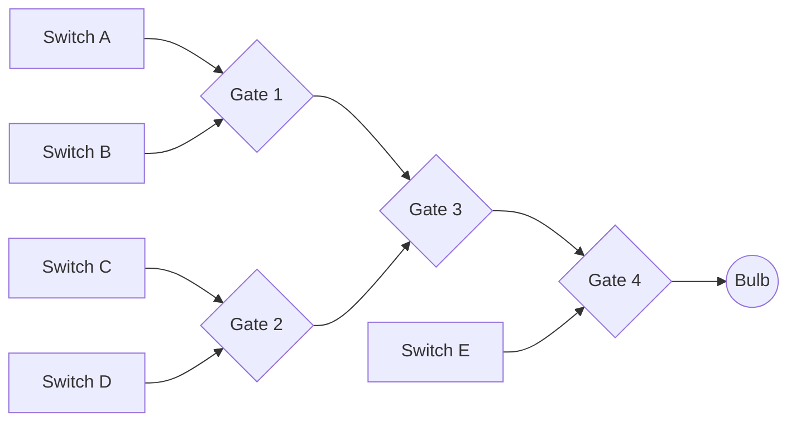

<div align="center">

# Lumio

A logic puzzle game in the browser. Flip the switches, light the bulb.

[](LICENSE)
[](#installation)
[](#requirements)
[](https://eaglestelle.github.io/Lumio/)

**Play it:** <https://eaglestelle.github.io/Lumio/>

</div>

## Contents

- [Overview](#overview)
- [How it works](#how-it-works)
- [Game modes](#game-modes)
- [Scoring](#scoring)
- [Requirements](#requirements)
- [Repository layout](#repository-layout)
- [Installation](#installation)
- [Configuration](#configuration)
- [Usage](#usage)
- [Deployment](#deployment)
- [License](#license)

## Overview

Each round draws a random circuit of logic gates and wires the switches into
it. The gate names are shown, the switch states are not solved for you: you set
the levers, submit, and the bulb tells you whether the final output was true.
Four difficulty modes vary the number of switches and the depth of the circuit,
and an endless toggle replaces the fixed ten rounds with a draining meter.

| Capability      | Description                                                                                 |
| --------------- | ------------------------------------------------------------------------------------------- |
| Random circuits | Every round redraws its gates from `AND`, `OR`, `NAND`, `NOR`, `XOR`, `XNOR`                |
| Four modes      | Easy through Extreme, from one gate and two switches to four gates and five switches        |
| Endless mode    | A meter that drains faster each round; correct answers refill it, wrong answers cut it      |
| Combo bonus     | Streaks of five or more add a growing refill bonus, with an on-screen combo popup           |
| Staged feedback | Intermediate bulbs light branch by branch, so a wrong answer shows where the circuit failed |
| Keyboard play   | Number keys toggle levers, `Enter` submits; no pointer required                             |
| Generated audio | Feedback tones are synthesised with the Web Audio API, so the repo ships no sound files     |
| Zero build      | Static HTML, CSS and ES modules; no bundler, package manager or server code                 |

## How it works

Every page is plain HTML that declares its mode on `<body data-mode="...">` and
loads the same [script.js](script.js). The script reads the mode, builds the
round, and delegates to three modules: lever input, bulb and label rendering,
and sound.



The circuit itself is evaluated in `getAllOutputs()`. Extreme mode is the full
shape; the easier modes are subsets of it:



State lives entirely in the page. Nothing is persisted beyond `sessionStorage`,
which carries the score, mode, endless flag and streak into the results screen.

## Game modes

| Mode    | Switches | Gates | Final output                                              |
| ------- | -------- | ----- | --------------------------------------------------------- |
| Easy    | 2        | 1     | `gate1(A, B)`                                             |
| Normal  | 4        | 2     | `gate1(A, B) AND gate2(C, D)` — the merge is always `AND` |
| Hard    | 4        | 3     | `gate3(gate1(A, B), gate2(C, D))`                         |
| Extreme | 5        | 4     | `gate4(gate3(gate1(A, B), gate2(C, D)), E)`               |

Each mode is a separate page, so its layout and colour can differ, but all four
share the same round logic. Endless is a toggle on the mode screen rather than a
fifth mode: it appends `endless=1` to the link and every mode can be played
either way.

## Scoring

Standard runs last ten rounds (`MAX_ROUNDS` in [script.js](script.js)), one
point per lit bulb, then the results screen grades the total.

Endless runs replace the round limit with a meter that starts at 100 and drains
continuously. The drain accelerates with the round number, and each submission
adjusts the meter; the run ends when it empties.

| Quantity         | Formula                                                                   |
| ---------------- | ------------------------------------------------------------------------- |
| Drain per second | `0.5 + log2(round) * 0.35 + (round - 1)^1.08 * 0.02`                      |
| Difficulty scale | `1 + (round - 1)^1.08 * 0.01`                                             |
| Correct answer   | `+3.8 * scale + comboBonus`                                               |
| Wrong answer     | `-4.2 * scale`                                                            |
| Combo bonus      | `min(log2(streak) * 0.6 + streak * 0.015, 5)`, applied from a streak of 5 |

The meter is frozen while an answer is being resolved, so the reveal animation
never costs time. A combo popup appears on every fifth consecutive correct
answer, and the streak carried into the results screen is the one that was live
when the run ended.

## Requirements

| Category | Requirement                                                                    |
| -------- | ------------------------------------------------------------------------------ |
| Browser  | Any modern browser with ES module and Web Audio support                        |
| Server   | Any static file server for local use; ES modules do not load over `file://`    |
| Network  | Bootstrap 5.3.3 and Bootstrap Icons 1.11.3 are loaded from jsDelivr at runtime |
| Tooling  | None. There is no build step, dependency manifest or backend                   |

## Repository layout

```
Lumio/
|-- index.html            title screen
|-- mode.html             difficulty picker and endless toggle
|-- game-easy.html        2 switches, 1 gate
|-- game-normal.html      4 switches, 2 gates
|-- game-hard.html        4 switches, 3 gates
|-- game-extreme.html     5 switches, 4 gates
|-- results.html          score, message and replay links
|-- script.js             round flow, gate evaluation, scoring, endless timer
|-- src/
|   |-- lever.js          switch state, lever graphics, keyboard bindings
|   |-- ui.js             bulbs, gate labels, status text, reveal sequence
|   `-- sound.js          Web Audio tones and the lever click
`-- favicon.png
```

The game pages are markup only. All shared behaviour lives in `script.js` and
`src/`, so adding a mode means writing a page, setting its `data-mode`, and
adding a branch to `getAllOutputs()`.

## Installation

The project is static, so cloning and serving is all that is required.

```bash
git clone https://github.com/EagleStelle/Lumio.git
cd Lumio
```

Serve the folder over HTTP. `script.js` is loaded as an ES module, which
browsers refuse to load from the file system:

```bash
python -m http.server 5500     # then open http://localhost:5500
```

Any equivalent works, for example `npx serve`, or the Live Server extension in
VS Code.

## Configuration

Tuning constants sit at the top of their modules; nothing else needs editing.

| Location                                                      | Controls                                                                  |
| ------------------------------------------------------------- | ------------------------------------------------------------------------- |
| `gates` in [script.js](script.js)                             | The pool a round draws from. Removing an entry removes it from every mode |
| `MAX_ROUNDS` in [script.js](script.js)                        | Length of a standard run                                                  |
| `getDrainPerSecond()`, `getEndlessDelta()`, `getComboBonus()` | Endless pacing and difficulty curve                                       |
| `getSubmitDelay()`                                            | Pause after a submission, per mode, so the reveal can finish              |
| `DEFAULT_VOLUMES` in [src/sound.js](src/sound.js)             | Volume of the correct, wrong and lever sounds                             |
| Score thresholds in [results.html](results.html)              | End-of-run messages for standard and endless runs                         |

## Usage

1. Open the title screen and press **Start**.
2. Pick a difficulty. Flip the **Endless** lever first if you want a timed run
   instead of ten rounds.
3. Read the gate names in the circuit, then set the levers to a combination
   that should drive the final output true.
4. Submit. Branch bulbs light in order, then the main bulb reports the result.
5. When the run ends, the results screen shows the score and offers a rematch in
   the same mode.

| Input             | Action                         |
| ----------------- | ------------------------------ |
| `1` – `5`         | Toggle switch A through E      |
| `Enter`           | Submit the current combination |
| Click a lever     | Toggle that switch             |
| Fullscreen button | Enter or leave fullscreen      |

Input is ignored while an answer is resolving, so a fast second press cannot
skip the reveal or double-score a round.

## Deployment

The repository is the site: push it to any static host and it works. It is
published to GitHub Pages from the repository root, which is why every asset
path is relative. Enable it under **Settings > Pages > Build and deployment**,
with `main` as the source branch and `/ (root)` as the folder.

Keep the paths relative. Absolute paths such as `/script.js` resolve to the
domain root and break on Pages, where the site is served from `/Lumio/`.

## License

[AGPL-3.0](LICENSE). Copyright (c) 2025
[EagleStelle](https://github.com/EagleStelle).
